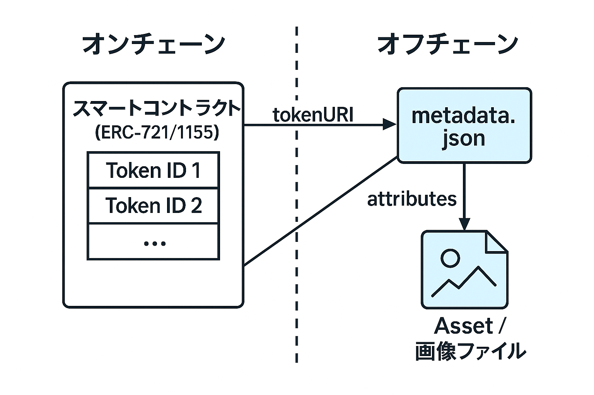
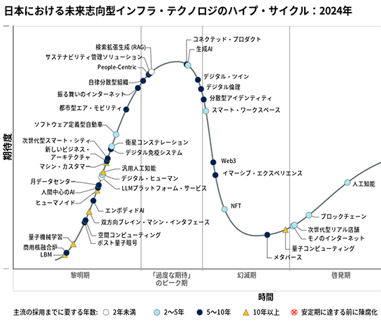
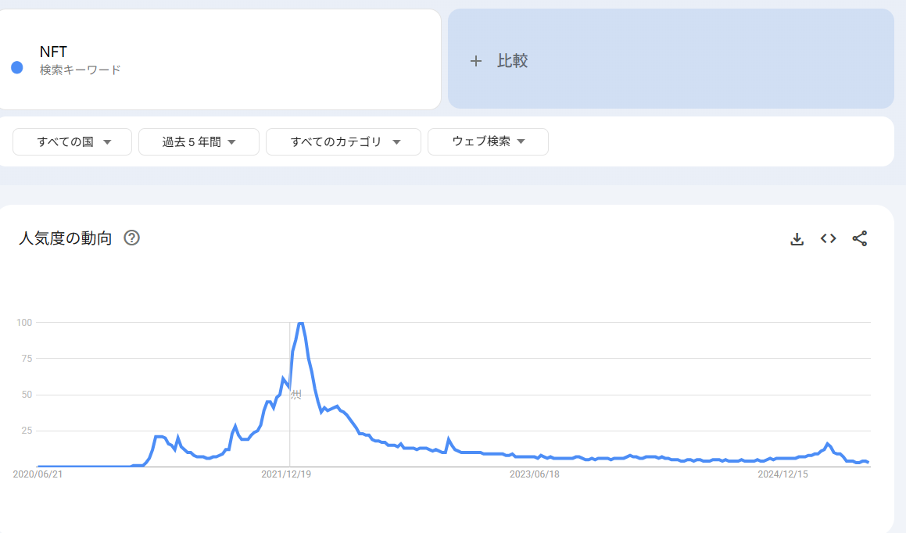
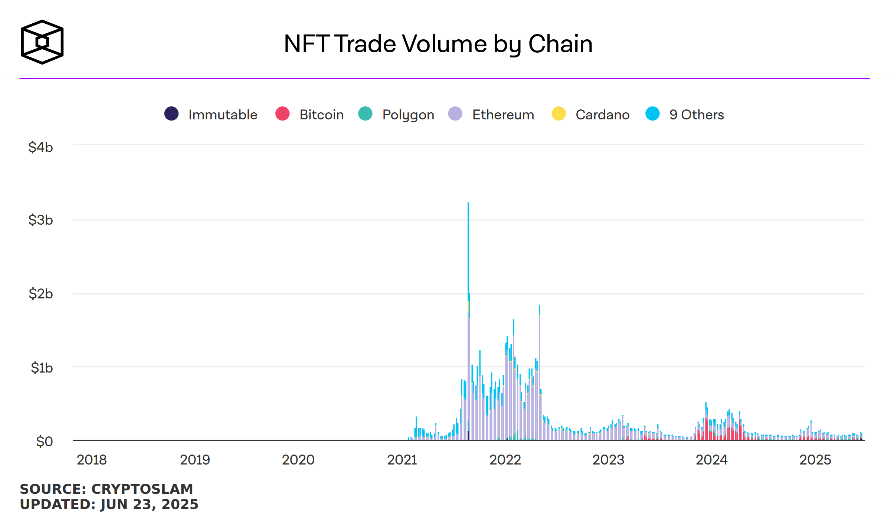
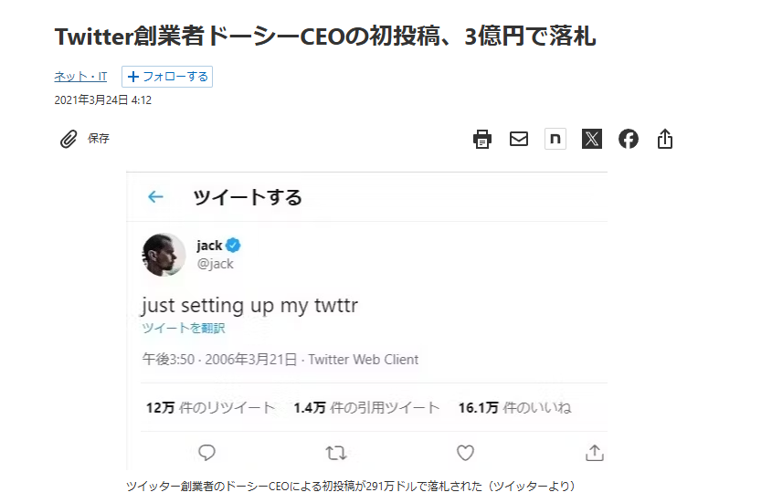
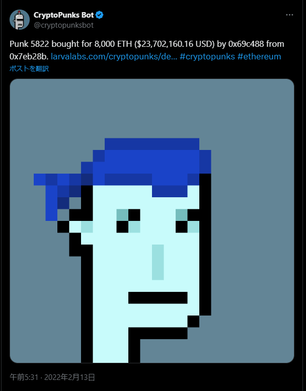
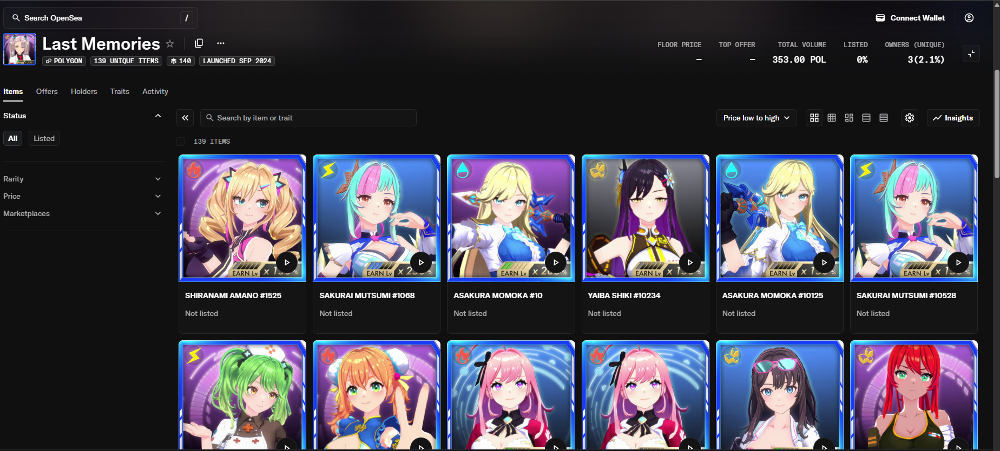
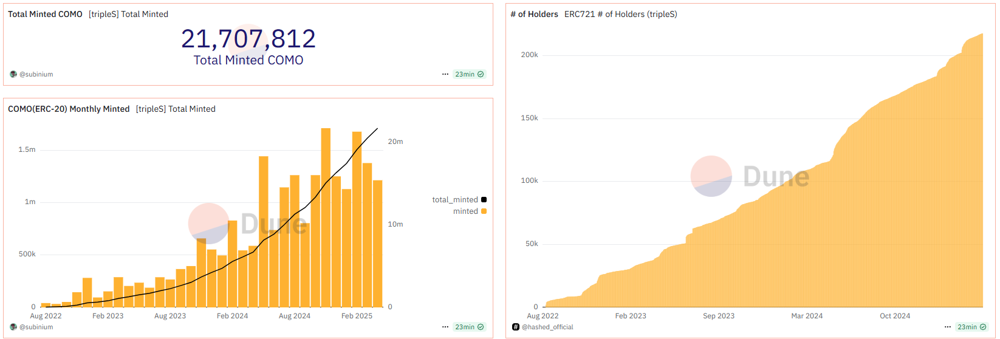

<!-- _paginate: false -->
<!-- _class: lead -->

# NFTの真実
## 〜技術と文脈が生み出す価値〜

---

# 自己紹介

- **大学**: [大学名を入力]
- **職歴**: [職歴を入力]
- **NFT/Web3経験**: 
  - ユーザーとしての歴: [年数を入力]
  - 関連プロジェクト: [プロジェクト名を入力]

---

# 今日の話の流れ

## 3部構成でNFTを理解する

### 第1部：基礎理解
NFTとは何か、どう捉えるべきか

### 第2部：現状と歴史
NFTの現在地、バブルと詐欺の実態

### 第3部：実用と技術
実際のユースケース、技術詳細、未来展望

---

<!-- _class: lead -->

# 第1部：基礎理解

---

# よく言われるNFTの定義

> 「代替不可能なデータ」
> 「唯一性が証明できる」

### でも現実は...
- 偽物が横行している
- 詐欺も多発している

**なぜこのギャップが生まれるのか？**

---

# NFTの正しい定義と理解

- **NFTは世界に一つしかない組み合わせの情報を持ったデータ**
- **NFTそれぞれが持っている情報全てがユニークなわけではない**
- **一意性を持つのはブロックチェーンに書き込まれた情報のみ**
- **「偽物のNFT」はオンチェーン情報を偽装しているわけではない**

### 今日のゴール
**この技術的な正確性を理解してもらうことが目標**

---

# NFTの範囲

### 3つのレイヤー

1. **デジタルトークン**
   チェーン+コントラクトアドレス+トークンID

2. **デジタルトークン + Metadata.json**
   トークン情報と属性データ

3. **デジタルトークン + Metadata.json + Image**
   画像まで含めた全体

**技術的にはレイヤー1のみがNFT**

---

# NFTはよく紙と表現される

### なぜ「紙」なのか
- NFT = 情報を書くための土台、そのものに価値はない
- 重要なのは「何が書かれているか」「誰が発行したか」「何に使えるか」

### この「紙」に書かれているもの
- **所有者アドレス**（誰が持っているか）
- **トークンID**（どの資産か）
- **メタデータ参照**（詳細情報へのリンク）

---

# 基礎理解のまとめ

## NFTの本質

- **技術的には**: ブロックチェーン上の一意なトークン
- **実態は**: 完全公開DB上の電子データ
- **利点**: 誰でも自由に参照可能
- **一意性**: チェーン+コントラクト+IDの組み合わせ
- **課題**: 99%のユーザーは画像を含めて認識

**技術と認識のギャップへの配慮が必要**

---

<!-- _class: lead -->

# 第2部：現状と歴史

---

# NFTの現在地

### 現在の位置：**幻滅期**

- ピーク時の過度な期待が崩壊
- 実用的な価値の模索段階
- 投機から実用へのシフト

### 検索トレンドも低下

- 2022年1月をピークに90%以上減少
- 一般的な関心は薄れている
- しかし技術開発は継続中

---

# NFTの歴史と具体的事例1：バブル

### バブルのピークと崩壊
- **2021年8月**: 月間約3,650億円（ピーク）
- **2022年5月**: 月間約30億円（99%減）
- **現在**: 安定した低水準で推移

### 教訓
**バブルは終わった。しかし技術は残った**

---

# NFTの歴史と具体的事例2：高額NFT

### ジャック・ドーシーの初ツイート
- 落札額：約3.2億円
- "just setting up my twttr"
- 現在の価値：ほぼ無価値

### CryptoPunks #5822
- 最高額：約27億円
- 2017年無料配布→億単位の取引へ
- Web3の象徴的存在

---

# 偽物・詐欺の実態と対策

### 偽物NFTの手口
- 人気プロジェクトの画像をコピー
- 類似名でコレクション作成、安く販売

### ラスメモの偽物事例
- 「ラストメモリーズ」NFTに偽物出現
- 公式と同じ画像・名前だが別コントラクト

### 見分け方と対策
- **「チェーン+コントラクトアドレス+トークンID」を確認**
- **公式アカウントから購入**
- **異常に安い価格は要注意**

---

# NFTは何でないのか

❌ **オリジナルであることが保証されたデータ**
→ データ自体はコピー可能

❌ **コピー不可能なデータ**
→ 画像などのコンテンツはコピー可能

❌ **所有権を示すもの**
→ 法的な所有権とは別物

❌ **金融商品**
→ 投機対象ではなく技術

---

# 現状理解のまとめ

## NFTを取り巻く環境

- **市場**: バブル崩壊後、幻滅期を経て実用段階へ
- **詐欺**: 偽物は存在するが技術的に判別可能
- **認識**: NFT ≠ 画像・コンテンツ、技術理解が重要
- **課題**: 99%のユーザーの認識とのギャップ

**冷静な理解と適切な活用が必要**

---

<!-- _class: lead -->

# 第3部：実用と技術

---

# NFTのユースケース例

- **会員権**: コミュニティアクセス、特典付与
- **チケット**: イベント入場券、転売防止
- **証明書**: 卒業証書、資格証明
- **ゲーム**: アイテム所有権、相互運用性
- **DeFi**: 金融ポジションの表現
- **アート**: デジタル作品の真正性証明

---

# 現在のメジャーユースケース1：ブロックチェーンゲーム

### MyCryptoHeroes（国内BCGの先駆け）
- キャラと装備がNFT、MMORPGのRMT型P2Eの初期モデル

### エグリプト（国内最大の成功事例）
- 基本は普通のスマホゲーム、たまにNFTキャラ出現、ゲーム性最優先

### Axie Infinity（P2Eの創始者）
- ポケモン風バトル、キャラ交配でNFT増殖、独自トークンがデファクトに

---

# 現在のメジャーユースケース2：Courtyard

### 概要
スニーカーやトレカなど高額コレクタブルをNFT化して安全に取引

### 仕組み
1. **預託**: 物理商品をCourtyardに送付 → NFT発行
2. **取引**: NFTの売買で所有権が即座に移転
3. **交換**: いつでもNFTと現物を交換可能

### 価値
- **偽物リスクゼロ**（専門家鑑定済み）
- **即時取引**（物理配送不要）
- **保管不要**（プロ管理の倉庫）

---

# 現在のメジャーユースケース3：TripleS

### 概要
ファンがNFTを通じてアイドルグループの活動に直接参加

### NFT活用
- **Objekts**: メンバーのフォトカードNFT
- **COMO**: ガバナンストークン機能
- **投票権**: メンバー選抜、楽曲選択、活動方針

### 価値
- デジタルフォトカードの真正性証明
- ファンが運営に参加できる新体験
- グローバルファンコミュニティ形成

---

# 現在のメジャーユースケース4：DeFiポジション

### UniswapやAerodromeの事例
- 流動性提供ポジションをNFT化
- ポジション情報をMetadataに記載
- 簡単に情報参照可能

### 想定できる使い方
- 1年間引き出せないデポジットをNFT化
- そのNFTをディスカウントで取引
- 流動性ニーズと長期保有ニーズのマッチング

---

# ERC721規格とは

### 概要
- 2018年1月承認、NFTの標準規格
ー　他にも拡張規格があるが、一般的に「NFT」とだけ言う場合はこれ
- 各トークンが一意のIDを持つ
ー　発行や転送など、基本的な一連の機能が定義されている

### 主要機能
- **ownerOf**: 所有者確認
- **transferFrom**: 移転
- **approve**: 移転許可
- **balanceOf**: 所有数確認

### 重要性
- **相互運用性**: どこでも取引可能
- **標準化**: 統一的な扱い
- **安全性**: 検証済み実装

---

# NFTの作り方

1. **チェーン選択**: Ethereum、Polygon等
2. **規格選択**: ERC721、ERC1155等
3. **コントラクト作成**: スマートコントラクトをデプロイ
4. **トークン発行**: mint関数でNFT生成

### カスタマイズ例
- 転送機能を外す（会員権用途）
- 条件付き転送

---

# よく言われることと反論

---

## 「NFTには価値がない」

### 批判
ただのJPEG画像に価値はない

### 反論
**1000円札も紙に数字と人の顔が書かれただけ**

- 価値は社会的文脈が生み出す
- 希少性、信頼、コミュニティが価値の源泉
- 技術は価値を記録・移転する手段

---

## 「代替不可能って言うけど偽物できてるじゃん」

### 批判
コピーできるので唯一性に意味がない

### 反論
**オンチェーンレベルでは偽造できていない**

- ブロックチェーン上の記録は改ざん不可能
- 「偽物」は別の場所にある「似たもの」
- 検証ツールで簡単に判別可能

---

## 「NFTは終わった」

### 批判
バブル崩壊で価値が暴落、もう終わり

### 反論
**ドットコムバブルでインターネットは終わったか？**

- 投機バブルが終わっただけ
- 技術の実用化は着実に進行中
- ゲーム、DeFi、会員権で実用例多数

---

# おまけ：オンチェーンデータだけがNFTと捉えるとできること

### 例：トークンAの多面性
- ゲームXでは：最強のキャラクター
- ゲームYでは：最弱のキャラクター  
- ゲームZでは：ありふれた武器

### Lootの事例
- テキストのみのNFT
- コミュニティが独自に解釈・活用
- 複数のゲームやプロジェクトで利用

---

# おまけ：NFTはマスアダプションするのか？

### 可能性1：データ主権への意識

#### 現在の動き
- Kindle本の「購入」vs「無期限レンタル」論争
- サービス終了によるデータ消失リスク
- 真の所有権への需要

#### NFTの役割
- デジタルデータの真の所有を可能に
- サービスに依存しない永続性

---

### 可能性2：自由に参照可能という利便性

#### 既存の需要
- オタク部屋、祭壇文化
- SNSでのコレクション自慢
- デジタルアイデンティティ表現

#### NFTの優位性
- 公式グッズの証明が容易
- 転売ヤー購入でないことも証明可能
- AIの時代に真正性がより重要に

---

# まとめ

## NFTの真実

1. **NFTは技術**であり、投機対象ではない
2. **価値は文脈**が生み出す
3. **実用化は着実に進行中**
4. **技術的理解**が重要

## 今後の展望
- ゲーム、DeFiでの更なる活用
- 新たなユースケースの登場
- 規制整備による健全な市場形成

**技術の本質を理解し、適切に活用することが重要**